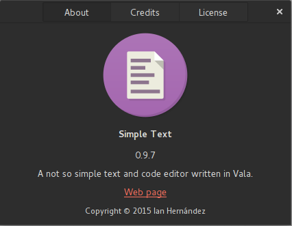
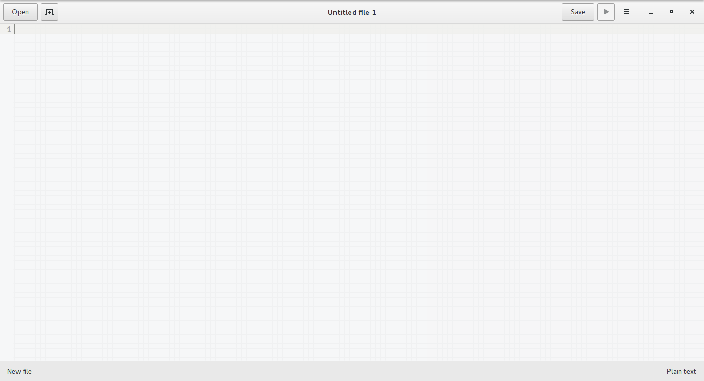
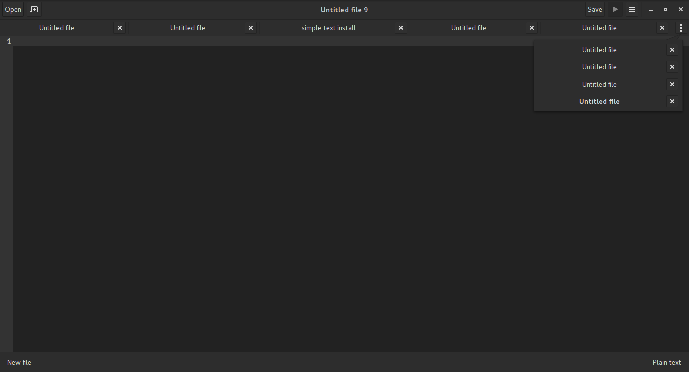
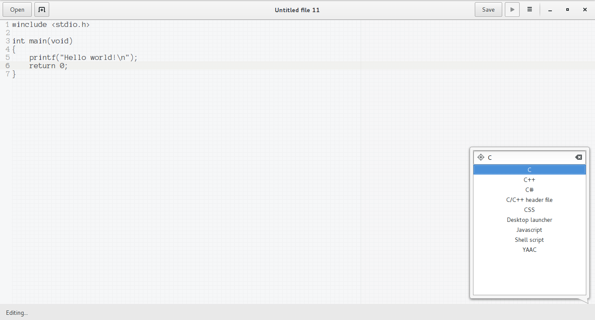
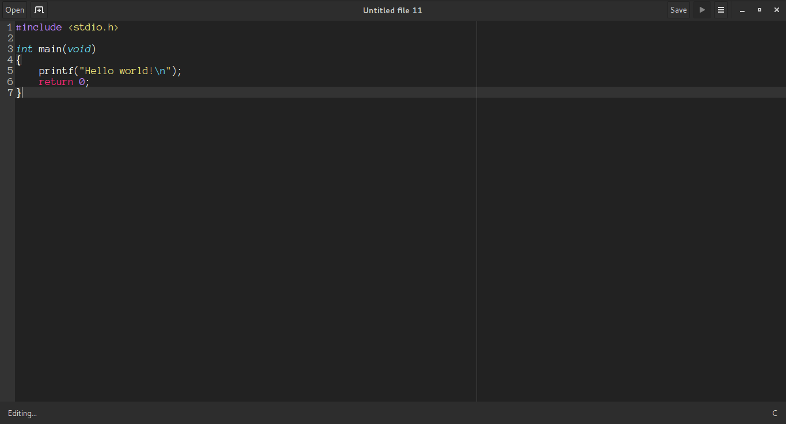
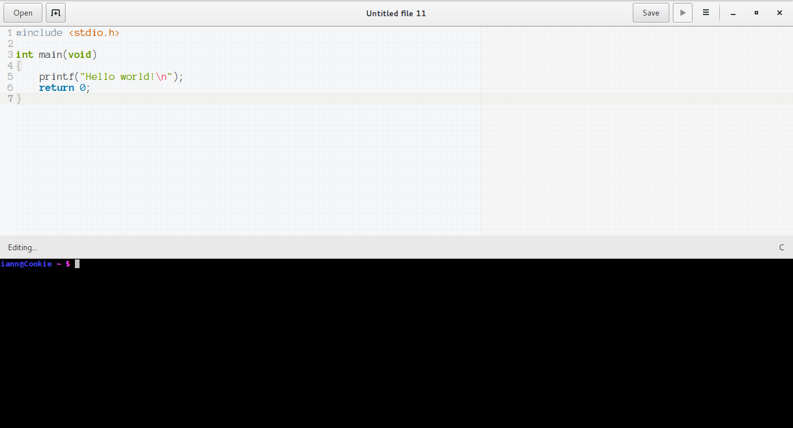
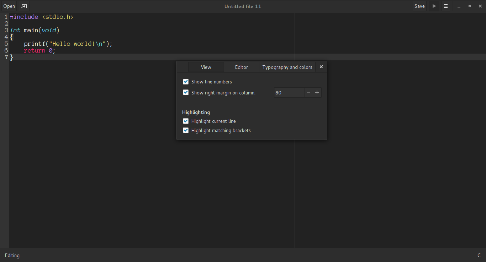

# Simple Text (beta)
A very simple text and code editor written in Vala.

Requires: Vala, GTK+ 3, GTKSourceView 3, Gee 0.8, VTE 2.91, dconf

Compiling: `$ make simple-text`  
Installing: `# make install`  
*If you're using ArchLinux there's an AUR package for it called simple-text*

### Main view

### Tab support

### Syntax setting

### Syntax highlighting

### Embeded terminal

### Edit preferences
