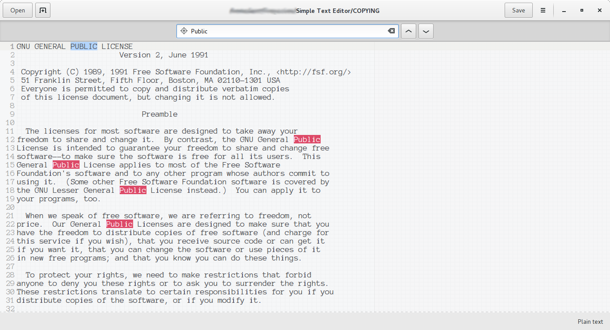
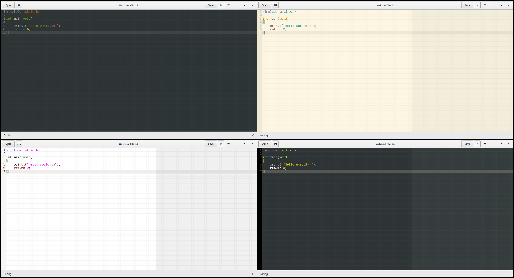

# Simple Text (beta)

***This project is now obsolete due to an error in vala compiler that prevents us from continuing the development. For further upgrades and updates please refer to the [new and rebranded package](https://github.com/badwolfie/quetzal)***

[](https://gitter.im/BadWolfie/simple-text?utm_source=badge&utm_medium=badge&utm_campaign=pr-badge&utm_content=badge)  

Simple Text is a text and code editor written in the Vala programming language using the GTK+3 toolkit, taking advantage of the GTKSourceView, VTE and other tools. 

It's currently available as an AUR package for ArchLinux and we are working to port it to other Linux distributions such as Debian and Fedora.

Check the [releases page](https://github.com/badwolfie/simple-text/releases) for installation options.  


## Installation

Dependencies (package names may vary depending on your distribution):
* gtk3 >= 3.16
* gtksourceview3
* libgee >= 0.8
* vte3
* dconf
* intltool
* vala

Also, the GNU autotools (autoconf, automake, ...)  
Then, simply:
```
	$ git clone https://github.com/badwolfie/simple-text.git
	$ cd simple-text
	$ ./autogen.sh
	$ ./configure
	$ make
	# make install
```

## Screenshots
#### Main view


#### Tab support


#### Syntax setting


#### Syntax highlighting


#### Embeded terminal


#### Edit preferences


#### Text searching


#### Color schemes


#### Dark theme variant


---

To report an issue or request a feature go to the [issues page](https://github.com/badwolfie/simple-text/issues) or contact me on my [e-mail](mailto:ihernandezs@openmailbox.org).

*Hope you really enjoy this project :)*
